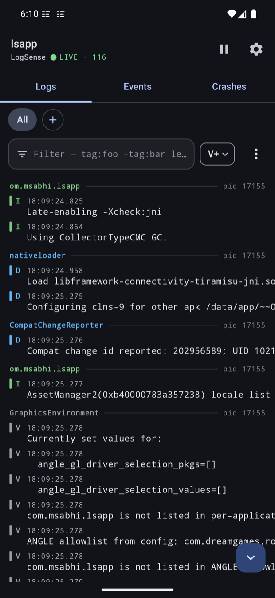
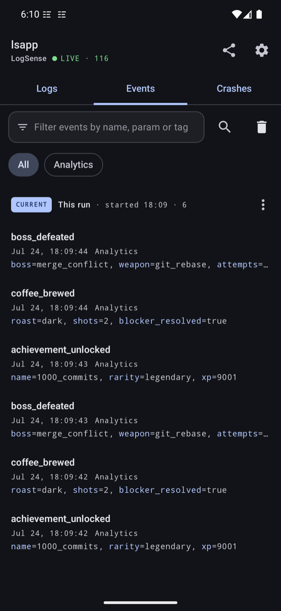
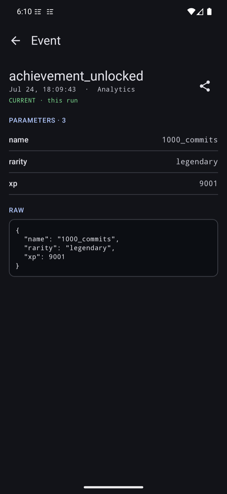
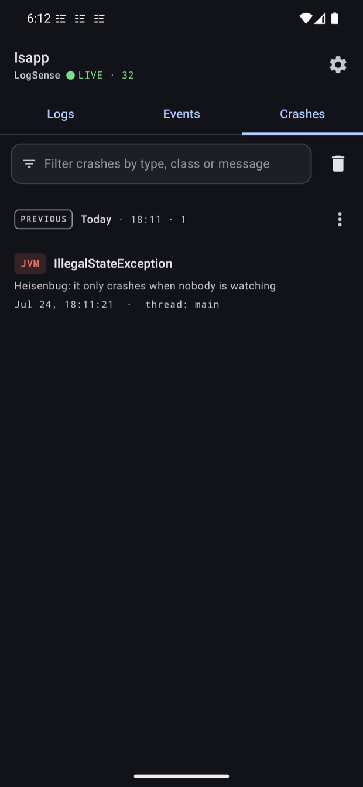
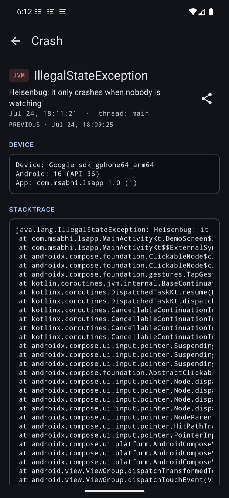

# LogSense

On-device logcat, analytics-event and crash viewer for Android debug builds — like Chucker, but for logs.

Debug builds usually don't report to Crashlytics, so a crash seen away from the laptop is lost, and verifying
analytics events means being tethered to Android Studio's logcat. LogSense streams your app's **own** logcat
right on the device: a live color-coded log viewer, analytics events lifted out of the stream and rendered
structured, and crash reports that survive process death — all reachable from a notification or a separate
launcher icon.

## Screenshots

<p align="center">
  
  
  
  
  
</p>
<p align="center"><sub>Live logcat &middot; analytics events &middot; event detail &middot; crashes &middot; crash detail</sub></p>

## Features

- **Live log viewer** — an on-device Logcat: multiple tabs each with their own filter, per-tab play/pause,
  standard/compact view, soft-wrap, scroll to top/bottom, tag autocomplete and restart. An Android-Studio-style
  filter query (`tag:` / `-tag:` / `msg:` / `level:` / free text) narrows the stream; a separate find bar
  searches the current view with match-case / whole-word / regex, match count and next/prev. Follow-tail with
  jump-to-latest, and share the filtered logs as text or a `.txt` file. Rows are selectable text, and each tag
  keeps its own color so interleaved subsystems stay apart. Pause/resume capture from the notification. Tabs
  persist across runs. Reads only the host app's own logs (`logcat --pid`), so **no permissions, no root,
  no adb** needed.
- **Analytics events** — `analyticsTagPatterns` maps each log tag to capture to an **optional regex**. With
  no regex (`null`), the built-in parser handles `name {json}`, `name Bundle[{k=v}]` and `name k=v, k2=v2`
  formats. For SDKs that bury the event name inside a JSON payload, give that tag a regex with `name` /
  `params` named groups — used for that tag only. A `params` group that captures a `{json}` object is parsed
  as JSON, and attribute sets crammed into a string field as escaped JSON are unwrapped into their own rows
  (or plug in your own `analyticsExtractor`). QA can add more tags — each with an optional regex — live in
  Settings. Per-tag tabs, live keyword filter, the same find bar, and export one / selected / all events as
  JSON (text or file).
- **Signal catalog** — 43 built-in signals across crash · ANR · native fault · memory · lifecycle, matched
  on the live stream and surfaced three ways: a colored gutter strip and an inline pill on the line itself, a
  live count on the **Signals** tab so you know without opening it, and the tab itself listing everything
  worth looking at in this run. Tap a signal to land on its line, scrolled into context and opened in full — a wide line is
  clipped in the list, and the part naming the culprit is usually the clipped part. Tap a crash signal to open
  its report. Conditions the app's own logcat can't show — force-stop, kill by signal, low-memory kill, first
  frame — are read from `ApplicationExitInfo` and the activity lifecycle instead of scraped from a log line,
  so they need no permission and carry a real cold-start number. Mute any built-in from the tab or Settings;
  add your own with `customSignals`, using the same query syntax as the filter field.
- **Crash triage** — every crash report opens with the topmost stack frame that belongs to *your* code
  rather than the framework, lifted out of a trace that is mostly framework noise — plus a note when the
  fault has a remedy that isn't obvious from its name. Derived on device, no symbol upload.
- **Crash capture** — an uncaught-exception handler writes the stacktrace, device info and the last ~200
  log lines to disk *before* the process dies, and posts a crash notification immediately (best-effort, from
  the crashing process) — tapping it opens the report once it's ingested on the next launch. ANRs and native
  crashes are picked up via `ApplicationExitInfo` (API 30+).
- **Sessions & deletion** — events and crashes survive process death, grouped by the run (session) that
  produced them, current run first. Swipe a row to delete with an undo snackbar, long-press to multi-select,
  delete a whole session, or clear everything. Old sessions are pruned (`maxSessions`, default 10).
- **UI** — Jetpack Compose, Material 3 with **Material You** dynamic color, follows the system light/dark
  (overridable in Settings), portrait / landscape / two-pane on large screens.
- **Zero release footprint** — a `logsense-no-op` twin artifact means release builds ship no tool code.

## Setup

```kotlin
// build.gradle.kts
dependencies {
    debugImplementation("com.msabhi:logsense:0.5.1")
    releaseImplementation("com.msabhi:logsense-no-op:0.5.1")
}
```

```kotlin
// Application class
class MyApp : Application() {
    override fun onCreate() {
        super.onCreate()
        // Capture the "Analytics" tag; null = parse it with the built-in parser. Give a tag a regex
        // (with (?<name>…) / optional (?<params>…) groups) instead of null for SDKs the parser can't infer.
        LogSense.init(this, LogSenseConfig(analyticsTagPatterns = mapOf("Analytics" to null)))
    }
}
```

That's it. Open LogSense from the capture notification, the LogSense launcher icon, or programmatically via
`startActivity(LogSense.getLaunchIntent(context))`.

### Configuration

Everything is optional; defaults shown:

```kotlin
LogSense.init(
    this,
    LogSenseConfig(
        analyticsTagPatterns = emptyMap(), // tag -> optional regex; null = built-in parser, regex = per-tag extractor
        analyticsExtractor = null,       // custom (tag, message) -> AnalyticsEvent?; overrides the per-tag regexes
        maxBufferedLines = 50_000,       // in-memory log ring buffer size (auto-reduced on low-RAM devices)
        captureJvmCrashes = true,        // install a chaining uncaught-exception handler; false = leave it to your reporter
        crashContextLines = 200,         // log lines attached to each crash report
        retentionDays = 7,               // stored events/crashes older than this are trimmed
        maxStoredEvents = 1_000,
        maxStoredCrashes = 50,
        showNotification = true,         // dismissable "recording" notification
        theme = ThemeMode.SYSTEM,        // or force LIGHT / DARK
        accentColor = null,              // ARGB int used as the Material primary color
        customSignals = emptyMap(),      // label -> filter query, on top of the built-in catalog
    ),
)
```

#### Custom signals

The built-in catalog already watches for crashes, ANRs, native faults, memory pressure and lifecycle events.
`customSignals` adds your own, written in the same query syntax as the Logs filter field — `tag:`, `-tag:`,
`msg:`, `level:`, bare words and `"quoted phrases"`, all ANDed:

```kotlin
customSignals = mapOf(
    "Payment declined" to """tag:Checkout msg:declined""",
    "Token refresh failed" to """level:W msg:"refresh token"""",
)
```

Custom signals are checked before the built-ins, so they win a line both could match. Any signal — yours or
built-in — can be switched off in Settings; a muted signal stops matching entirely.

### Notes

- **Notifications**: LogSense declares `POST_NOTIFICATIONS` but never requests it — request it from your app
  (see the sample's `MainActivity`). Without it the UI is still reachable via the launcher icon.
- **Launcher icon**: remove it if unwanted:
  ```xml
  <activity-alias android:name="com.msabhi.logsense.Launcher" tools:node="remove" />
  ```
  Its label comes from `logsense_launcher_label`, so you can rename it from your own `strings.xml`
  if you run several LogSense-equipped builds side by side.
- Live logs live in memory only and are cleared on process death; analytics events and crashes are persisted
  (Room) and clearable from the UI. Signal hits live with the log buffer for the same reason — a hit whose
  line is gone is a jump that lands nowhere. Crashes, ANRs and native faults persist as crash reports.
- Log lines are capped by logcat at ~4 KB — very large analytics payloads may arrive truncated.

## Sample app

The `app` module demos everything: log generators for each level, the three analytics formats, signal
triggers (simulated catalog lines plus real jank and a real StrictMode violation), a custom signal, a JVM
crash button and an ANR button.

## Modules

| Module | Contents |
|---|---|
| `logsense` | The library (Compose UI, logcat reader, Room storage, crash handler) |
| `logsense-no-op` | Same public API as empty stubs, zero dependencies |
| `app` | Sample/demo app |
