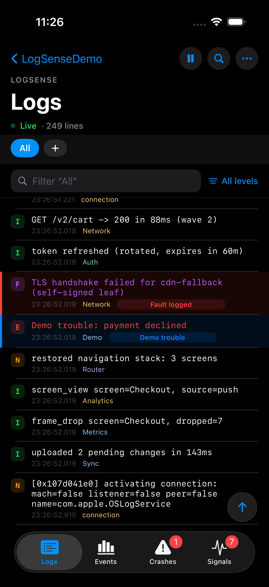
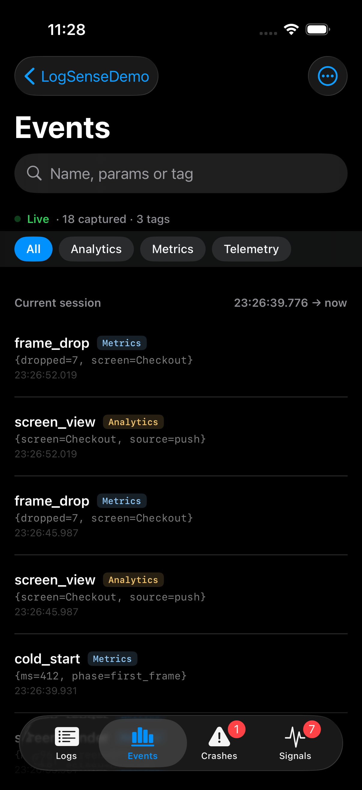
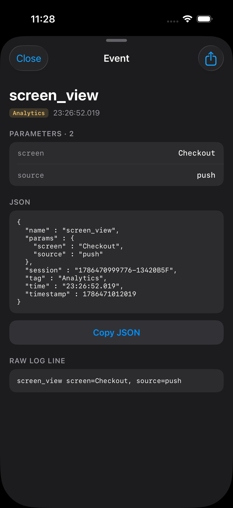
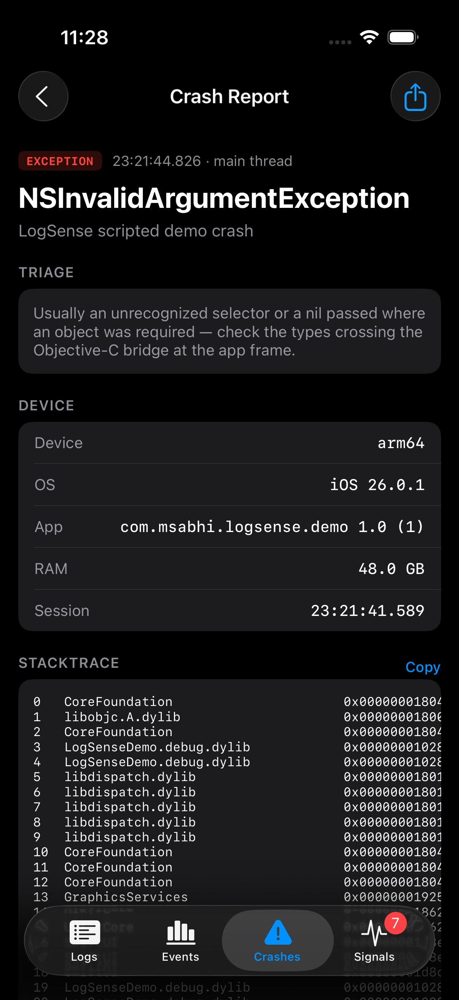
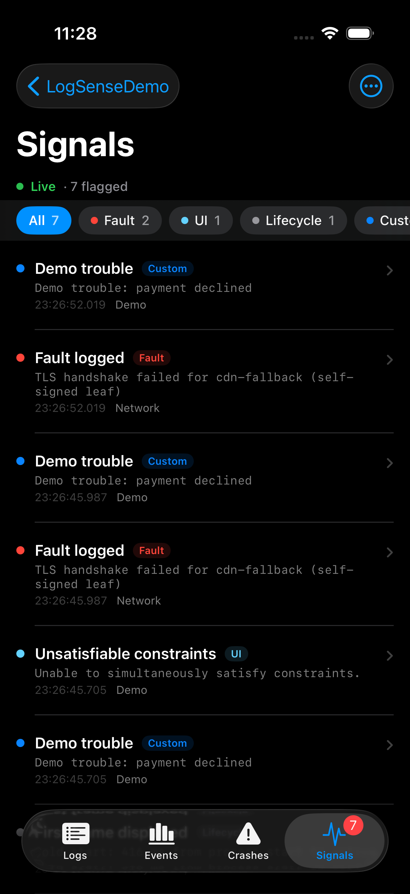
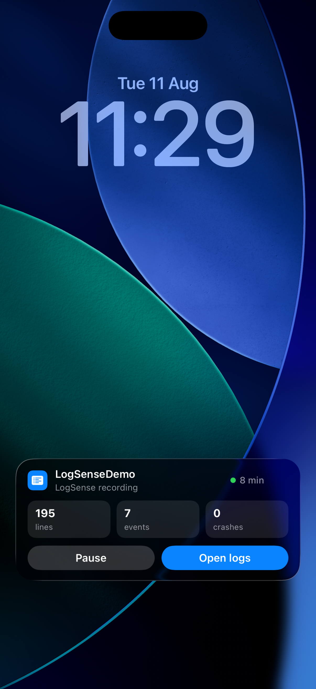

# LogSense for Apple platforms

The same product as the [Android library](../android/README.md), expressed in Apple's vocabulary:
an in-app developer/QA tool for **debug builds** that streams the app's own logs live, lifts
analytics events out of the stream, captures crashes that survive process death, and flags known
trouble patterns — built so the tool itself never noticeably burdens the host app.

<p align="center">
  
  
  
  
  
</p>
<p align="center"><sub>Live logs &middot; analytics events &middot; event detail &middot; crash report &middot; signals</sub></p>

## Supports

- **iOS 16.0+** (Live Activity 16.2+; its buttons 17+). iPhone and iPad; light and dark.
- **Simulator first-class** — most day-to-day iOS development happens there, so capture,
  performance containment and the demo are all validated on the simulator (and on device).
- **Swift 5.9+ / Xcode 15+**, pure Swift + SwiftUI, **zero dependencies**.
- macOS appears in the manifest only so `swift test` runs the pure-logic tests without a
  simulator; the product is an iOS library.

## Install — Swift Package Manager only

There is no CocoaPods podspec and none is planned. In Xcode: **File ▸ Add Package
Dependencies…**, paste the repository URL, rule *Up to Next Major* from `0.6.13`. Or in a
`Package.swift`:

```swift
.package(url: "https://github.com/abhimuktheeswarar/LogSense.git", from: "0.6.13")
```

The manifest lives at the repository root and points into `apple/` — add the package from the
root URL, not a subpath.

## Integrate (debug builds only)

SPM has no per-build-configuration dependencies — Android's `debugImplementation` /
`releaseImplementation` split has no SPM equivalent — so the debug fence lives at the call site.
**Add one new file to your app target** — call it `LogSenseSetup.swift` — and keep every
LogSense call in it, with a no-op stub in the `#else`; that stub is the release "artifact":

```swift
// LogSenseSetup.swift — the only file in the app that touches LogSense.
#if DEBUG
import LogSense

enum LogSenseSetup {
    static func start() {
        var config = LogSenseConfig()
        config.analyticsTagPatterns = [
            // nil = the built-in parser handles this tag's lines (see Analytics events below).
            "Analytics": nil,
            // A regex captures only matching lines — for SDKs the parser can't infer, or an
            // app-level dispatcher that mirrors every SDK's events through one logger. This
            // example matches lines like `[MyApp] [CRM] event name = purchase , payload = {…}`;
            // the (?<tag>…) group splits the one log tag into per-SDK event tags. Dispatchers
            // that log via bare os_log()/NSLog carry the binary's name as their log tag, hence
            // the processName key.
            ProcessInfo.processInfo.processName:
                #"\[MyApp\] \[(?<tag>Analytics|CRM)\] event name =\s+(?<name>\S+)\s*,\s*payload = (?<params>\{[\s\S]*)"#,
        ]
        LogSense.start(config)
    }
}
#else
enum LogSenseSetup { static func start() {} }
#endif
```

**Where to call it** — the first thing in your app's launch path, **before any crash-reporting
SDK configures** (crash reporters chain to whatever exception handler is already installed —
starting LogSense first means both fire; second also works, but first never surprises anyone):

- **UIKit lifecycle**: in `AppDelegate.swift`, at the top of
  `application(_:didFinishLaunchingWithOptions:)`:

  ```swift
  func application(_ application: UIApplication,
                   didFinishLaunchingWithOptions launchOptions: [UIApplication.LaunchOptionsKey: Any]?) -> Bool {
      LogSenseSetup.start()
      // FirebaseApp.configure() / your crash reporter / the rest of launch…
      return true
  }
  ```

- **SwiftUI lifecycle**: in the `init()` of your `@main struct MyApp: App`.

Because the package links statically and release builds contain no references to its symbols,
dead-code stripping removes LogSense from release binaries entirely — zero bytes ship.

## Opening LogSense

iOS allows exactly one Home Screen icon per app, so Android's second-launcher-icon entry has no
equivalent. The entry points, closest-first:

- **Long-press the app icon** → the "Open LogSense" quick action (registered automatically).
  iOS delivers the tap to *your* scene delegate — in the class implementing
  `UIWindowSceneDelegate` (typically `SceneDelegate.swift`), forward it from
  `windowScene(_:performActionFor:completionHandler:)`:

  ```swift
  func windowScene(_ windowScene: UIWindowScene,
                   performActionFor shortcutItem: UIApplicationShortcutItem,
                   completionHandler: @escaping (Bool) -> Void) {
      if LogSense.handleShortcut(shortcutItem) { completionHandler(true); return }
      // your own shortcuts…
  }
  ```

  (Wrap the LogSense line in `#if DEBUG` — or route it through `LogSenseSetup` — like every
  other call site.)
- **Crash notification tap** deep-links to the report list. If your app sets its own
  `UNUserNotificationCenter` delegate, forward from that class's
  `userNotificationCenter(_:didReceive:withCompletionHandler:)` with one line:
  `if LogSense.handleNotificationResponse(response) { completionHandler(); return }`.
  If your app sets **no** delegate, LogSense claims the vacant slot itself — zero code.
- **Programmatic**: `LogSense.present()` (its own overlay window above your app), or embed
  `LogSenseView` in a debug menu or hidden gesture of your choosing. LogSense deliberately claims
  no global gesture: shake, in particular, is often taken.

## Analytics events

`analyticsTagPatterns` maps a **log tag** to an optional regex. A tag here is the unified-log
*category*; `NSLog` and bare `os_log()` lines have no category, so they carry the logging
binary's name — an app whose analytics SDKs all log through one dispatcher configures that
single tag (usually `ProcessInfo.processInfo.processName`).

- **`nil` regex** → the built-in parser: `name {json}`, `name Bundle[{k=v}]`,
  `name k=v, k2=v2`, Swift-`Dictionary` descriptions, and ObjC plist-dict dumps
  (`key = value;`), with escaped-JSON string fields unwrapped into flat params.
- **A regex** → used for that tag only, one pattern per line, first match wins. Named groups:
  - `(?<name>…)` — the event name (required; non-matching lines are skipped),
  - `(?<params>…)` — the payload, parsed by the same shared parser,
  - `(?<tag>…)` — names the event's real source, splitting one dispatcher tag into per-SDK
    event tags (each with its own stable color and filter pill in the Events screen). Settings
    lists the tags a pattern declares.
- QA can add more tags (each with an optional regex) live in Settings; config-defined tags are
  locked. A custom `analyticsExtractor` closure overrides everything for bespoke formats.

Events persist per session (JSON export, per-event or bulk), with a "keep past events" toggle
(off by default), `retentionDays` and `maxStoredEvents` caps.

## Live Activity (iOS 16.2+)

<p align="center">
  
</p>

The stand-in for Android's ongoing capture notification: one activity per capture session in the
Dynamic Island and on the Lock Screen — line/event/crash counts, a session clock, amber while
paused, and a red takeover with the exception and throwing frame the moment a crash is caught
(it stays red until the report is seen). On iOS 17+ the buttons (Pause, Resume, Stop, Keep
recording, Open) are App Intents that work without unlocking the phone.

ActivityKit requires Live Activity UI to live in a **widget extension owned by the host app** —
a Swift package cannot ship an app extension, so no library can enable this for you. Two steps:

1. App target: `NSSupportsLiveActivities = YES` (Info.plist, or the
   `INFOPLIST_KEY_NSSupportsLiveActivities` build setting).
2. In your widget extension target, find the `@main struct … : WidgetBundle` (the file Xcode
   names `<YourApp>Widgets.swift` when it creates the extension) and add one line to its body —
   create a widget extension first if you don't have one (File ▸ New ▸ Target ▸ Widget
   Extension):

   ```swift
   @main
   struct MyAppWidgets: WidgetBundle {
       var body: some Widget {
           MyExistingWidget()
           #if DEBUG
           LogSenseLiveActivity()   // add `import LogSense` under the same fence
           #endif
       }
   }
   ```

Without the extension, everything else works — the activity simply never appears. QA can switch
it off under Settings → Live Activity; when the host doesn't enable it, the toggle shows
disabled with the reason.

## How capture is implemented

Android has `logcat --pid`: one process-scoped stream you can tail forever. Apple platforms
have **no equivalent** — there is no API that streams a process its own log lines as they
happen. What iOS gives an app is `OSLogStore(scope: .currentProcessIdentifier)`: a *queryable
snapshot* of its own unified-log entries (`Logger`, `os_log`, `NSLog` — from app code,
third-party SDKs and system frameworks in-process alike). LogSense's capture is built around
making that snapshot API behave like a tail without burdening the host:

1. **Poll, don't tail** — a background thread (`.utility` QoS) periodically opens an entry
   enumerator on the store. Each poll asks the store *natively* for only the new lines with an
   `NSPredicate("date >= last-seen")` — pushed down because materializing an `OSLogEntry`
   costs ~1 ms each, so skipping a chatty host's history object-by-object would burn a core.
   (The API's `position(date:)` hint and `.reverse` option would both be cheaper still — both
   are silently ignored by the OS; measured, which is why the predicate is the path.)
2. **Dedupe at the boundary** — entries carrying exactly the last-seen timestamp are
   fingerprinted (message + thread) so a line is never ingested twice across polls, the same
   resume-dedupe shape as the Android reader's `logcat -T`.
3. **Adaptive cadence** — an enumerator costs up to ~1 s to construct regardless of how many
   lines are new; that floor can't be optimized away, so the *cadence* is the lever. The loop
   sleeps at least 2× the poll's own cost (4× while the LogSense UI isn't open), stretches up
   to 5× while the host is quiet, snaps back the moment lines arrive, and wakes early when the
   UI opens. The store object is reused while polls deliver and re-created after an empty poll,
   so capture self-heals on OS versions where a retained store behaves as a frozen snapshot.
4. **`print()` via stdout interception** — Swift's `print` writes to stdout, which never
   touches the unified log. With `captureStandardOutput` on (default), LogSense saves the
   original descriptor with `dup`, redirects stdout into a pipe with `dup2`, sets line
   buffering (`setvbuf`), reads the pipe on a background queue — and **tees every byte back**
   to the saved descriptor, so the Xcode console keeps showing prints while LogSense captures
   them.
5. **One fan-out per batch** — each poll's batch is appended to the in-memory ring buffer and
   handed *once* to the signal and analytics detectors on the ingesting thread — matching
   happens per line, not per view render.
6. **Self-diagnosis** — capture logs one probe line at start; a store still empty after
   several polls is provably diverted (an Xcode-launched run), not quiet, and the UI says so.
   Every poll also writes one status line to `capture-health.txt` beside the session store —
   a capture that silently sees nothing must be able to report itself.

**Host-impact containment** (the project's hard rule — the tool must never noticeably burden
the app): beyond the duty-cycled cadence, UI publishing is object-granular (only the Logs
screen re-renders per batch, and only while the UI is visible), the list renders a window of
the newest 2,000 rows, signal scans are bounded to each line's first 1 KB, and the buffer
budgets both lines (50k) and bytes (50 MB default) — oldest evicted first, newest always kept.

**Crashes**: NSExceptions are captured in-process by a *chaining* uncaught-exception handler —
last log lines attached, written durably (fsync + rename) before the process dies, ingested
next launch; your existing crash reporter still runs, always. Swift traps, memory faults,
watchdog kills and hangs arrive via MetricKit on the next launch, unsymbolicated (the report
says so rather than pretending otherwise). LogSense installs **no signal handlers**,
deliberately: production crash reporters own those.

## Xcode & platform limitations

Everything below is measured behavior, not speculation — and most "LogSense shows nothing"
reports trace to the first two items.

- **Runs launched by Xcode divert the log stream.** When Xcode launches the app — debugger
  attached *or not* — the process's unified-log entries go to the IDE console instead of the
  log store, so capture (and therefore Events and Signals) sees nothing; only `print()` output
  still arrives. LogSense detects this — capture logs a probe line at start, and a store still
  empty after several polls is provably diverted, not quiet — and both the Logs and Events
  screens show a card saying so. **Workflow: build with ⌘B, then launch by tapping the app
  icon.** (The old `IDEPreferLogStreaming=YES` workaround no longer restores store delivery on
  current Xcode.)
- **The simulator's log daemon can stay wedged after an Xcode run** — subsequent icon launches
  still capture nothing for the rest of that simulator boot (lines are visibly received via
  `log stream` but never persisted for `log show`/`OSLogStore`). Fix: reboot the simulator
  (`xcrun simctl shutdown` + `boot`), then launch from the icon.
- **`OSLogStore` is a snapshot API, not a tail.** There is no push/stream API for a process's
  own entries: each poll constructs a fresh enumerator, which costs up to ~1 s on the simulator
  regardless of how many lines are new — that floor is why the poll cadence is adaptive rather
  than fixed. The `position(date:)` hint and the `.reverse` enumeration option are **silently
  ignored** on current OS releases (measured), which is why new-line selection is pushed down
  as an `NSPredicate` instead.
- **~1 KB entry truncation.** The OS truncates long unified-log messages; big analytics
  payloads may arrive cut. LogSense's parsers tolerate a missing closing brace and keep the
  pairs that survived. (stdout lines are not truncated by the OS; LogSense caps them at 16 KB.)
- **`<private>` interpolations.** Dynamic values logged without `%{public}` read back as
  `<private>` when the app runs detached from Xcode — unified logging's privacy model, not a
  LogSense gap.
- **`print()` is invisible to the log store** — that's exactly what stdout capture is for; with
  it on, both LogSense and the Xcode console see prints.
- **Live Activities need a host-owned widget extension** (see above) — an SPM package cannot
  provide one.
- **No per-configuration SPM dependencies** — hence the `#if DEBUG` fence pattern instead of a
  separate no-op artifact (release builds strip the library entirely; see Integrate).
- **MetricKit does not deliver on the simulator** — use Xcode ▸ Debug ▸ Simulate MetricKit
  Diagnostic, or a device, to see trap/hang reports.
- The in-memory log buffer dies with the process, by design; events and crashes persist.

## Troubleshooting

| Symptom | Likely cause / fix |
|---|---|
| Logs show only `print:` lines, no events | Run was launched by Xcode → stream diverted. ⌘B, launch from the icon. LogSense shows a card when it detects this. |
| Icon launch still captures nothing (simulator) | Wedged simulator logd — reboot the simulator, launch from the icon. |
| Events missing for one SDK | That SDK's lines aren't reaching the unified log, or the pattern doesn't match — check the raw line in Logs, then test the regex. `capture-health.txt` (app container ▸ Application Support/LogSense) says whether capture is delivering at all. |
| Payload cut off mid-JSON | The OS's ~1 KB entry cap — the parser keeps what survived; log a shorter mirror if you need everything. |
| Live Activity never appears | The host hasn't added the widget-extension registration, or the Settings toggle is off. |

## Configuration

Everything is a defaulted parameter on `LogSenseConfig` — analytics tag patterns (with per-tag
regexes exposing `(?<name>)`, `(?<params>)` and `(?<tag>)` groups), custom signals in the same
query syntax as the Logs filter (`tag:` `-tag:` `msg:` `sub:` `level:` bare words
`"quoted phrases"`), buffer caps (`maxBufferedLines`, `maxBufferedBytes`), retention
(`retentionDays`, `maxStoredEvents`, `maxStoredCrashes`, `maxSessions`), crash capture toggle,
Live Activity toggle, theme and accent. See the doc comments in `LogSenseConfig.swift`.

## Demo

`apple/Demo/LogSenseDemo.xcodeproj` — one button per capture claim: every level, NSLog, print,
private-vs-public interpolation, burst, analytics payload shapes, signal lines, and both crash
paths. Scripted-run hooks: launch env `LOGSENSE_AUTO_OPEN=1` opens LogSense after launch,
`LOGSENSE_CRASH_AFTER=1` raises a crash a few seconds in. Remember the limitation above: launch
the demo from the simulator's home screen, not from Xcode, to see full capture.

## Development

Pure logic is tested on macOS — `swift test` from the repository root, no simulator needed.
The package builds for iOS with `xcodebuild -scheme LogSense -destination 'generic/platform=iOS Simulator' build`.
